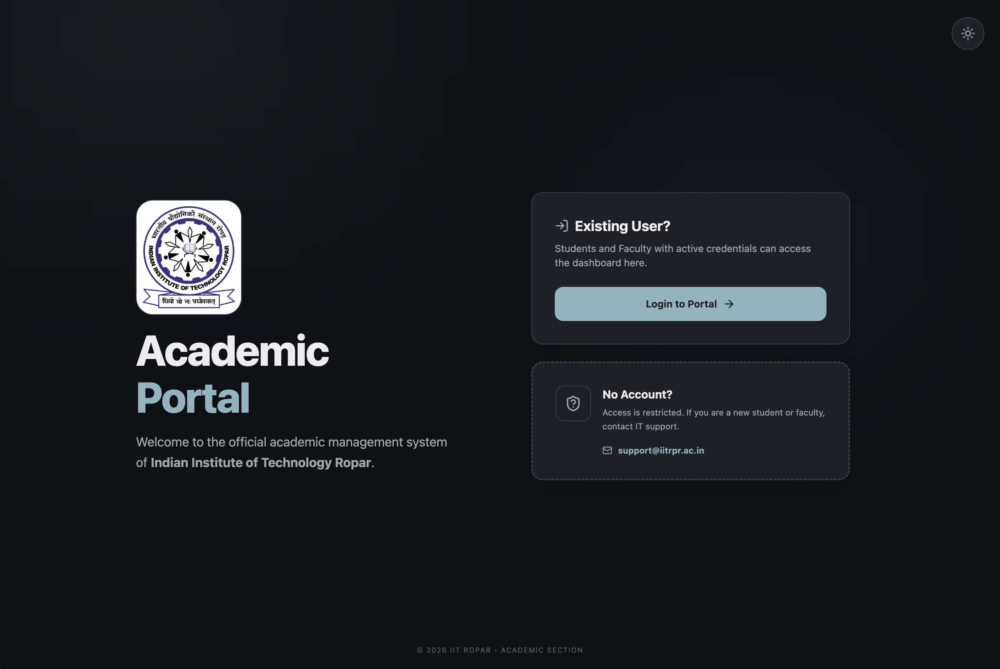

# Academic Portal

College Academic Management System build as an assignment project. Contains Students, Professors, and Administrators roles.



## Features

* Email-based OTP login system.
* Role-Based Dashboards:
    * **Student:** Browse course catalog, manage enrollments, view grades & CGPA
    * **Professor:** Propose courses, manage student approvals, publish grades
    * **Admin:** User management (Bulk Generator), system configuration, and audit logs.

## Setup

1.  **Clone the repository**
    ```bash
    git clone https://github.com/ShivangNagta/DEP_Acad_Portal
    cd DEP_Acad_Portal
    ```

2.  **Run Server**
* Ensure the secret keys in .env are filled
    ```bash
    cd server
    npm install
    npm start
    ```

3.  **Run client**
    ```bash
    cd client
    npm install
    npm run dev
    ```
